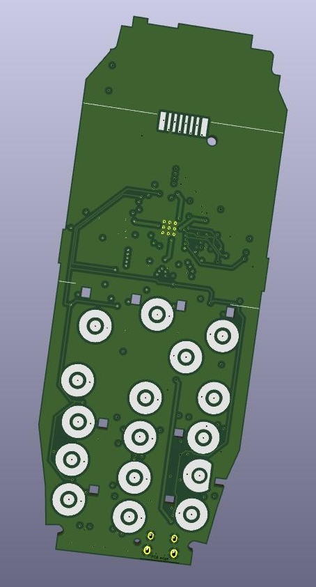
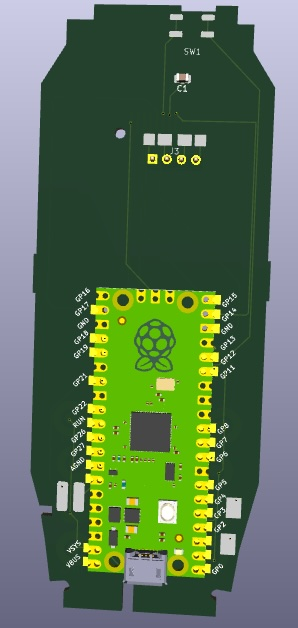

# RP2040 Nokia 3310 Adapter Board

This started as a cute "what if?":

> What if I could typeout messages on my smartphone by using tactile buttons like I used to have on my phone back in high school?

Because the board would need to fit into the chassis of a Nokia 3310 and because there are existing doodads that would be sitting alongside the board anyways, scope has crept to include connecting to these other thingamajigs.

### Pin Assignment

- Vibration: GP28
- Buzzer: GP4
- Keypad:
	- Clear GP11
	- 1 GP8
	- 2 GP7
	- 3 GP22
	- 4 GP6
	- 5 GP5
	- 6 GP27
	- 7 GP2
	- 8 GP3
	- 9 GP21
	- * GP0
	- 0 GP1
	- # GP26 
- Display:
	- 1 3.3V
	- 2 GP18 SPI0 SCK
	- 3 GP19 SPI0 TX
	- 4 GP15 D/C
	- 5 GP17 SPI0 CSn
	- 6 GND
	- 7 GND + cap
	- 8 GP14 Reset

### Sim card notes
/¯¯¯¯¯¯¯¯¯¯¯¯¯¯¯¯¯ 
|io /\ clock
|Vpp|| reset
|gnd\/Vcc

Vpp does not matter
protocol is custom but simple and well enough documented
but not easy going from zero to something that works here
what tests can i do?
probably needs to use pio
so something to leave for last

### TODO
#### Hardware
- use on-board 2350 instead of connected pico board.  an opportunity to reassign pins.  GP0+1 should be left available for debugging.  leave adc available for adc functions.
- add pads for more buttons: up/down/select
- sim card connection
- power from battery
- power button (currently it is a second boot button)
- detect battery type to refuse NiMH
- LiPo charging
- add LEDs to lightup keypad and display
- optional pico-w for wifi/bluetooth (using a module avoids need for recertification?)

#### Software
- USB numpad keyboard example
- finish no_std RTTTL parsing library and release
- use embedded_graphics for console display
- create example that plays RTTTL (and writes it to screen)
- create keypad abstraction
- test fake keypresses to create multi-tap converter
- implement USB keyboard
- interface with optional pico-w to expose keypad as bluetooth keyboard (speaker for notifications)
- read/write to sim card

#### Misc
- Come up with better name

https://serdisplib.sourceforge.net/ser/pcd8544.html
